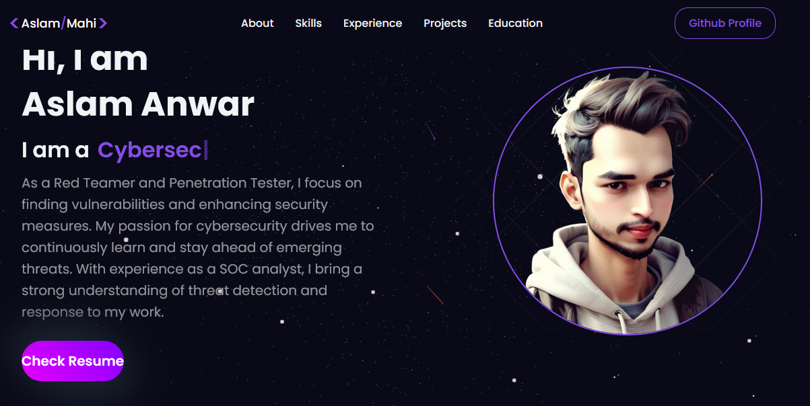
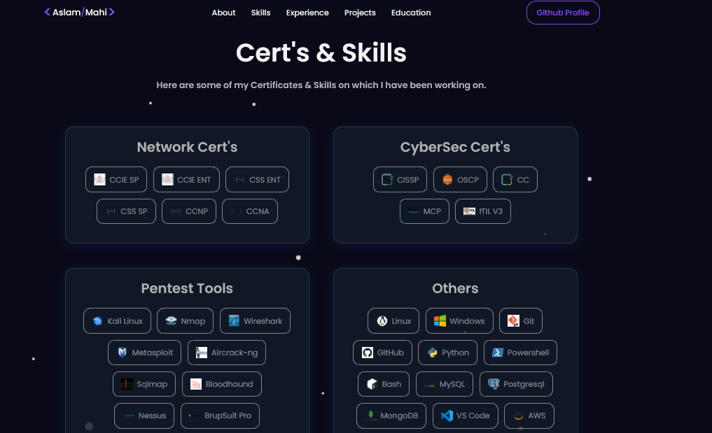
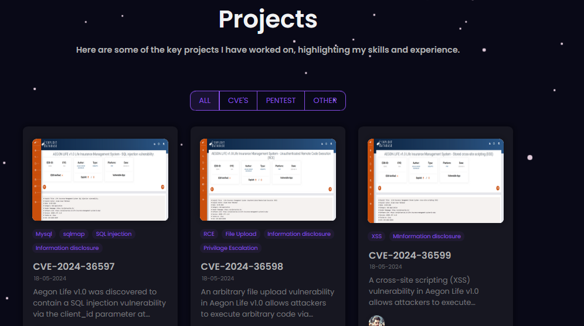
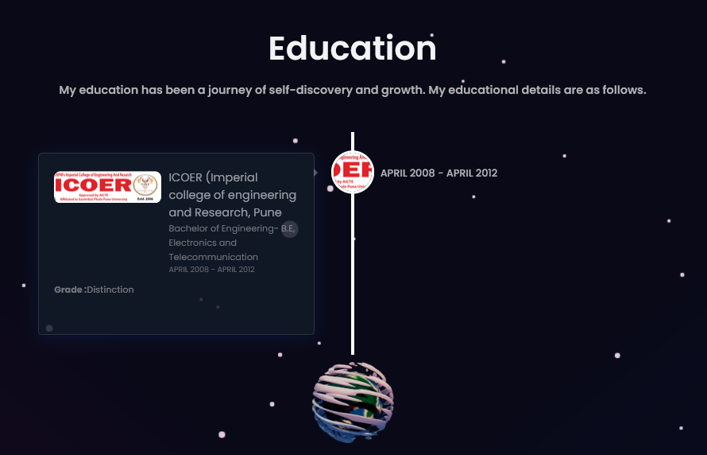

# AslamMahi Portfolio

## Introduction
Welcome to my portfolio website, built with React.js. This site serves as a digital resume and showcase of my work, skills, and accomplishments in the field of cybersecurity. Explore my background, projects, and more through this interactive and visually engaging platform.

## Live Website
- [Visit My Portfolio](https://aslammahi.github.io/)

## Features
- **About Me**: A section detailing my professional journey, skills, and personal insights.
- **Projects**: Showcases a selection of my key projects with in-depth descriptions and visuals.
- **Skills**: Highlights my technical expertise and areas of proficiency.
- **Resume**: Provides a downloadable version of my resume for detailed career information.
- **Contact**: Offers a way to reach out to me directly through a contact form.

## Technologies Used
- **React.js**: A powerful JavaScript library for creating dynamic user interfaces.
- **HTML5 & CSS3**: Fundamental technologies for building and styling web pages.
- **JavaScript**: Adds interactive elements to enhance user experience.
- **Styled-Components**: Utilized for modular and scalable styling within the application.
- **Git**: Version control system used for managing project changes.
- **GitHub Pages**: Deployed on GitHub Pages for easy hosting and distribution.

## Installation
To set up this portfolio locally, follow these steps:

1. Clone the repository: `git clone https://github.com/AslamMahi/AslamMahi.github.io.git`
2. Navigate to the project directory: `cd AslamMahi.github.io`
3. Install the necessary packages: `npm install`
4. Launch the development server: `npm start`
5. Open your browser and go to: `http://localhost:3000`

## Usage
After setting up the project locally, navigate through the different sections using the site's navigation menu. The **About Me** section provides insights into my professional background. **Projects** displays my work with detailed descriptions and images. **Skills** lists my technical proficiencies. The **Contact** section allows you to send me inquiries or messages directly.

## Portfolio Images

### About Me

### Skills

### Experience

### Projects

### Education

### Contact

## License
This project is licensed under the [MIT License](LICENSE).

## Acknowledgements
Special thanks to [Rishav Chanda](https://github.com/rishavchanda) for the inspiration and foundational work on which this portfolio is based.
